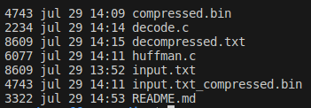

# Greedy_Huffman_Coding

**Conteúdo da Disciplina**: Código de Huffman, Algoritmos Gulosos<br>

## Alunos

| Matrícula  | Aluno          |
| ---------- | -------------- |
| 22/2037657 | Arthur Alves   |
| 21/1031495 | Samuel Ricardo |

### Sobre

O objetivo deste projeto é desenvolver um sistema de compressão e descompressão de arquivos utilizando a codificação de Huffman. O sistema lê um arquivo de texto, comprime o conteúdo utilizando o algoritmo de Huffman e, posteriormente, descomprime o arquivo comprimido para recuperar o texto original.

### Justificativa

Este projeto foi implementado em C para exercitar o uso de estruturas de dados com o mínimo de abstrações, proporcionando uma visão mais clara e detalhada das etapas do algoritmo. A escolha da linguagem C permite um controle mais direto sobre a memória e o processamento, o que é fundamental para compreender a eficiência e o funcionamento interno do algoritmo de Huffman.

### Funcionalidade

- **Compressão**: O sistema lê um arquivo de texto e aplica a codificação de Huffman para gerar um arquivo comprimido, armazenando também a tabela de códigos no cabeçalho do arquivo comprimido.
- **Descompressão**: O sistema lê o arquivo comprimido, utiliza a tabela de códigos armazenada no cabeçalho para decodificar o conteúdo e reconstrói o texto original.

Este projeto demonstra a aplicação prática de algoritmos de compressão, destacando a importância das estruturas de dados na otimização de processos e no gerenciamento eficiente de recursos.

#### Restrições

- Apenas arquivos com extensão `.txt` são suportados para compressão.
- Apenas arquivos com extensão `.bin` são suportados para descompressão.
- Os nomes dos arquivos devem ser fornecidos com as suas respectivas extensões.
- O programa está restrito à codificação de caracteres pertencentes apenas ao conjunto ASCII.

### Screenshots
<center>



</center>

- A primeira coluna representa o tamanho dos arquivos em bytes.
- Observe o tamanho original de `input.txt`, que é 8609 bytes.
- Após a compressão, o arquivo `input.txt_compressed.bin` possui 4743 bytes, indicando uma redução de aproximadamente 45% do arquivo em relação ao original.
- O arquivo `decompressed.txt` possui 8609 bytes, o mesmo tamanho do arquivo original, indicando baixíssimas chances de ter ocorrido perda de dados.

## Instalação

**Linguagem**: C<br>

### Pré-requisitos

- GCC instalado (compilador de C)

### Instruções

Aqui está a versão melhorada dos passos 1 e 2:

1. **Clone o repositório**:
    - Clone o repositório do projeto usando o seguinte comando:
    ```sh
    git clone https://github.com/projeto-de-algoritmos-2024/Greedy_Huffman_Coding.git
    ```

2. **Navegue até o diretório do projeto**:
    - Após clonar o repositório, entre no diretório do projeto com o comando:
    ```sh
   cd Greedy_Huffman_Coding
    ```
3. **Compile o código de compressão**:
   ```sh
   gcc huffman.c -o compress
   ```
4. **Compile o código de descompressão**:
   ```sh
   gcc decode.c -o decompress
   ```
5. **Execute o código de compressão**:
    - Para executar o código de compressão, passe o nome do arquivo `.txt` que deseja comprimir como argumento. Por exemplo, se o arquivo que deseja comprimir se chama `input.txt`, execute:
    ```sh
    ./compress input.txt
    ```
    - Isso irá gerar um arquivo comprimido com o nome `input.txt_compressed.bin`.

6. **Execute o código de descompressão**:
    - Para executar o código de descompressão, passe o nome do arquivo `.bin` que deseja descomprimir como argumento. Por exemplo, se o arquivo comprimido se chama `input.txt_compressed.bin`, execute:
    ```sh
    ./decompress input.txt_compressed.bin
    ```
    - Isso irá gerar um arquivo descomprimido com o conteúdo original com o nome `decompressed.txt`.

## Vídeo Apresentação
[Assista ao Vídeo no Youtube](https://youtu.be/naIQpKC1yIE)